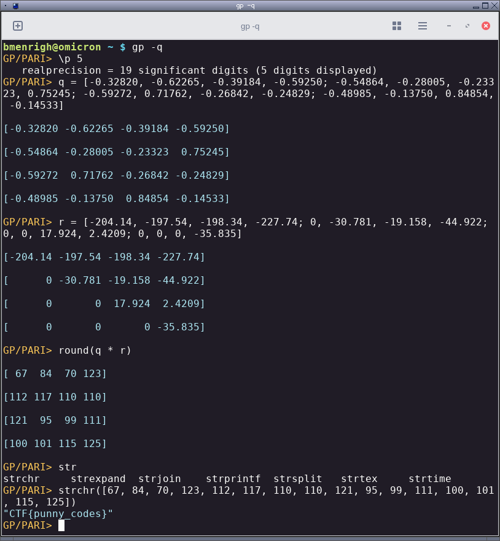

## qr-decomp

This challenge uses the [QR-Decomposition of a matrix](https://en.wikipedia.org/wiki/QR_decomposition) to split a 4x4 matrix into two matrices. The flag is 16 characters and was encoded into the rows of the 4x4 matrix before decomposition.

Scan QR 1 and see this text:

    M4x4 = [f, l, a, g; h, e, r, e; ....]
    
    # Decompose
    M -> Q * R
    
    # Have fun solving and come play the CTF!
    

Assemble the two halfs of QR 2a and 2b and see this text:

    Q =
    
    [-0.32820 -0.62265 -0.39184 -0.59250]
    
    [-0.54864 -0.28005 -0.23323  0.75245]
    
    [-0.59272  0.71762 -0.26842 -0.24829]
    
    [-0.48985 -0.13750  0.84854 -0.14533]
    

Assemble the two halfs of QR 3a and 3b and see this text:

    R =
    
    [-204.14 -197.54 -198.34 -227.74]
    
    [      0 -30.781 -19.158 -44.922]
    
    [      0       0  17.924  2.4209]
    
    [      0       0       0 -35.835]

Multiply the two matrices together to get the flag (in ASCII values):

    bmenrigh@omicron ~ $ gp -q
    
    GP/PARI> \p 5
       realprecision = 19 significant digits (5 digits displayed)
    
    GP/PARI> q = [-0.32820, -0.62265, -0.39184, -0.59250; -0.54864, -0.28005, -0.23323, 0.75245; -0.59272, 0.71762, -0.26842, -0.24829; -0.48985, -0.13750, 0.84854, -0.14533]
    
    [-0.32820 -0.62265 -0.39184 -0.59250]
    
    [-0.54864 -0.28005 -0.23323  0.75245]
    
    [-0.59272  0.71762 -0.26842 -0.24829]
    
    [-0.48985 -0.13750  0.84854 -0.14533]
    
    GP/PARI> r = [-204.14, -197.54, -198.34, -227.74; 0, -30.781, -19.158, -44.922; 0, 0, 17.924, 2.4209; 0, 0, 0, -35.835]
    
    [-204.14 -197.54 -198.34 -227.74]
    
    [      0 -30.781 -19.158 -44.922]
    
    [      0       0  17.924  2.4209]
    
    [      0       0       0 -35.835]
    
    GP/PARI> round(q * r)
                                                                                    [ 67  84  70 123]
    [112 117 110 110]
    
    [121  95  99 111]
    
    [100 101 115 125]
    
    GP/PARI> strchr([67, 84, 70, 123, 112, 117, 110, 110, 121, 95, 99, 111, 100, 101, 115, 125])
    "CTF{punny_codes}"

